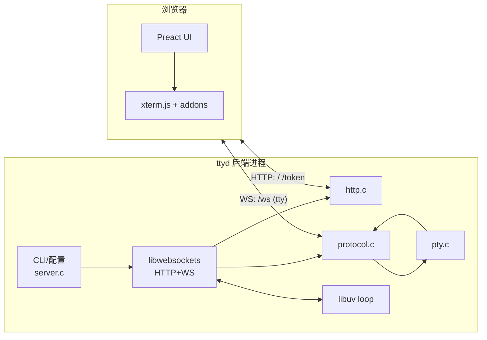
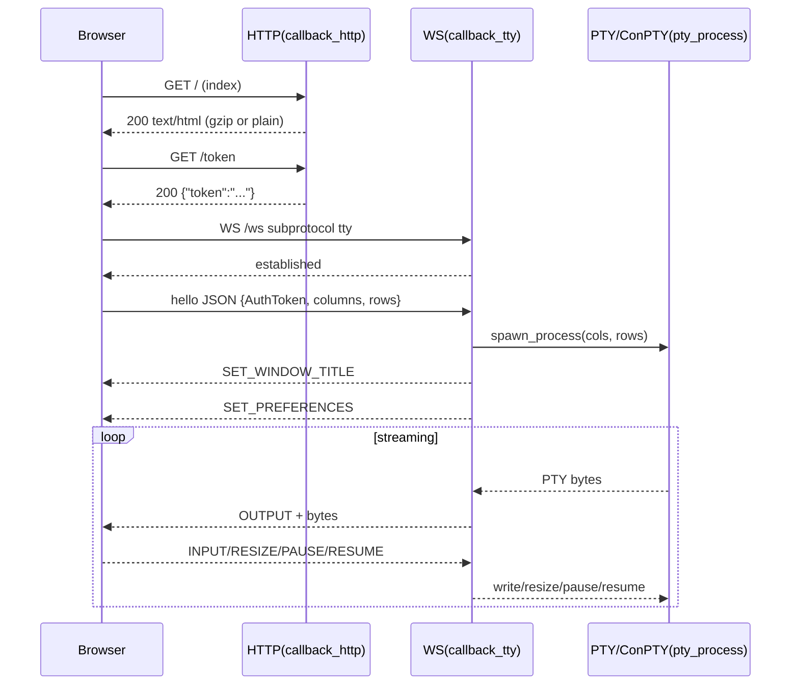

# `ttyd` 仓库深度走读报告（以源码为事实源）

生成日期：2026-02-23  
仓库路径：`<repo-root>`  

约束说明（重要）：
- 本报告与同仓库的 `spec/`、`ui-ux-spec/` 一样，**只以源码与可执行配置为事实源**。
- 按你的要求，走读过程中**不读取仓库现存文档**：`README*`、`docs/**`、`man/**` 与任何既有 `*.md`。

---

## 1. 一句话结论（Executive Summary）

`ttyd` 是一个“单进程、事件驱动”的终端共享服务：后端用 libwebsockets 提供 HTTP + WebSocket；前端用 Preact + xterm.js 渲染终端；当浏览器通过 WS 完成首包 JSON 握手后，后端为该连接启动一个 PTY/ConPTY 子进程并双向转发字节流，从而在浏览器中获得真实终端会话。

---

## 2. 全局地图（Architecture Map）

### 2.1 目录与职责

- `src/`：后端 C 实现（HTTP、WS 协议、PTY/ConPTY、工具）
- `html/`：前端工程（webpack + gulp），构建后生成 `src/html.h` 供后端内嵌返回
- `CMakeLists.txt` / `cmake/`：CMake 构建与 Git 版本号计算
- `scripts/`：交叉编译与 Windows(MSYS2) 构建脚本
- `.github/workflows/`：CI/CD（backend/frontend/docker/release）
- `Dockerfile*`：运行时镜像定义
- `snap/`：snapcraft 打包

### 2.2 组件依赖图（Mermaid）



---

## 3. 入口与关键执行流（Entrypoint → Critical Path）

### 3.1 后端入口：`src/server.c:main`

关键路径：
1) 解析 `<command> [args...]` 的起始位置（避免 getopt 混淆）
2) 构造全局 `server`（含 uv loop）
3) 解析 CLI 参数并构造：
   - 鉴权策略（Basic / auth-header）
   - endpoints（base-path 重写）
   - TLS/IPv6/UNIX socket 等
   - 前端 preferences JSON（`--client-option` 汇总）
4) 创建 lws context/vhost，并把 `server->loop` 作为 foreign loop 注入
5) 注册 SIGINT/SIGTERM，进入 `lws_service(context,0)`

### 3.2 关键时序：浏览器访问 → WS 握手 → spawn → 双向流



---

## 4. 核心模块深挖（High-Leverage Subsystems）

> 这里按“杠杆最大”选择模块：理解它们就理解了整个仓库的行为边界。

### 4.1 HTTP handler（`src/http.c`）

重点：
- 路由由 `endpoints` 控制（默认 `/`、`/token`，base-path 会整体前缀化）
- 鉴权优先级：
  1) `--auth-header`：缺失时返回 407 + `Proxy-Authenticate: Basic realm="ttyd"`
  2) `--credential`：缺失/不匹配时返回 401 + `WWW-Authenticate: Basic realm="ttyd"`
  3) 否则无需鉴权
- `/token` 返回 JSON：`{"token":"<base64>"}`（未启用 credential 则为空串）
- `/` 返回 UI：
  - 若 `--index`：直接 serve 文件
  - 否则返回内嵌 `index_html`（gzip bytes）或解压缓存 `html_cache`（取决于编译宏与 Accept-Encoding）

风险点：
- gzip/解压分支受编译宏 `LWS_WITH_HTTP_STREAM_COMPRESSION` 影响，复刻实现必须覆盖两种形态。

### 4.2 WS 协议与会话管理（`src/protocol.c` + `src/server.h`）

协议要点：
- WS 端点必须匹配 `endpoints.ws`
- 子协议 `tty`
- 首包 JSON 触发 spawn（并可选校验 token）
- 业务帧格式：1 字节命令码 + payload（INPUT/RESIZE/PAUSE/RESUME；OUTPUT/TITLE/PREFERENCES）
- 会话级约束：once/max-clients/check-origin/auth

风险点：
- Basic Auth 模式下存在“两段式鉴权”：WS filter 阶段校验 Authorization；WS 首包 JSON 再校验 AuthToken。容易被移植时遗漏。

### 4.3 PTY/ConPTY（`src/pty.c`）

价值点：
- 用统一结构体 `pty_process` 抽象跨平台 spawn、读写、resize、kill、退出回调；
- 通过 libuv pipe 与 async，把“PTY IO + 子进程退出事件”统一投递到 uv loop。

风险点（技术债）：
- `paused` 标志位与 `pty_pause/pty_resume` guard 条件不一致，可能导致 PAUSE 实际不生效；复刻实现必须记录并决定“保持还是修复”（详见 `spec/09_Verification/KNOWN_GAPS.md`）。

### 4.4 前端协议实现（`html/src/components/terminal/xterm/index.ts`）

价值点：
- 该文件同时承担：
  - WS hello、二进制帧编码/解码
  - preferences 合并（默认 + server + URL query）
  - 重连策略（自动/手动 Enter）
  - overlay 微文案与时序
  - rendererType 的加载与降级
  - selection copy 的剪刀提示
  - beforeunload 离开提示

风险点：
- 微文案必须逐字一致（`…`、`⏎` 等），否则“复刻级”验收会失败。

### 4.5 构建/发布链路（CMake + webpack/gulp + CI）

价值点：
- CMake 强制 libwebsockets 必须启用 libuv，否则直接 FATAL；
- 前端 pipeline 把 dist/index.html 内联成 dist/inline.html，再 gzip 并生成 `src/html.h`；
- CI 工作流覆盖：
  - cross-build 多 target
  - docker multi-arch build/push
  - release artifact 整理 + SHA256SUMS

风险点：
- `.github/workflows/frontend.yml` 的 path filter 只写了 `html/*`，对 `html/src/**` 的触发依赖 GitHub 的匹配行为；复刻时要小心（可在保持行为一致前提下优化 glob）。

---

## 5. 上手实操（Getting Started，基于源码推导）

### 5.1 构建后端

```bash
mkdir -p build
cd build
cmake ..
cmake --build .
```

依赖要求与编译宏见 `spec/07_Infrastructure/BUILD.md`。

### 5.2 运行（最常见）

```bash
./ttyd -W bash
```

然后访问：`http://localhost:7681/`。

### 5.3 前端开发（可选）

```bash
cd html
corepack enable
corepack prepare yarn@stable --activate
yarn install
yarn start
```

devServer 会代理 `/token` 与 `/ws` 到本地后端（默认 `http://localhost:7681`）。

---

## 6. 评分（Scorecard，100 分制）

> 评分基于“从源码观察到的事实”，不是主观喜好。每项给出原因与改进建议。

| 维度 | 分数 | 依据（证据点） | 建议 |
|---|---:|---|---|
| 架构清晰度 | 15/15 | 单进程 + 明确分层：server/http/protocol/pty | - |
| 接口契约清晰度 | 12/15 | WS 协议简单（命令字节），但“两段式鉴权”隐含且容易漏 | 在代码中补充注释/测试；或把 token/Authorization 统一化 |
| 可维护性 | 12/15 | 文件少且集中；但有少量“怪异实现细节”（paused、-t loop） | 加回归测试锁定行为或修复并记录 |
| 跨平台能力 | 13/15 | Unix PTY + Windows ConPTY 两套实现 | 增加 Windows CI/测试覆盖 |
| 构建与发布成熟度 | 14/15 | cross-build、docker、release、snap 都齐全 | 前端 workflow path glob 可改进 |
| 可观测性 | 8/10 | lws 日志较多；HTTP/WS 有 access log/notice | 增加结构化日志/可选 log level 文档 |
| 安全性（基础） | 8/10 | 支持 basic/proxy header、origin check、TLS | 提供更明确的 auth-header 安全边界说明与测试 |
| 测试可用性 | 3/5 | 仓库默认无测试 | 按 `spec/08_Testing/*` 补齐自动化测试 |

总分：85/100

---

## 7. Top 改进建议（按影响/成本排序）

1) **补齐回归测试**：至少覆盖 WS 协议、鉴权、base-path、once/max、gzip 分支、PTY spawn/exit。  
2) **明确并锁定“怪异行为”**：例如 PTY pause/resume 标志位不一致，决定“保持”还是“修复”，并在 release note/KNOWN_GAPS 记录。  
3) **完善 CI 触发条件**：前端 workflow 的 path filter 更精确地覆盖 `html/src/**`。  
4) **增强安全可操作性**：为 `--auth-header` 明确威胁模型（header 伪造风险）、推荐配合反代配置。  

---

## 8. 附录：关键文件索引

后端：
- `src/server.c`、`src/server.h`
- `src/http.c`
- `src/protocol.c`
- `src/pty.c`、`src/pty.h`
- `src/utils.c`、`src/utils.h`

前端：
- `html/src/components/app.tsx`
- `html/src/components/terminal/index.tsx`
- `html/src/components/terminal/xterm/index.ts`
- `html/src/components/terminal/xterm/addons/overlay.ts`
- `html/src/components/terminal/xterm/addons/zmodem.ts`
- `html/src/components/modal/*`
- `html/src/style/index.scss`

构建/发布：
- `CMakeLists.txt`、`cmake/GetGitVersion.cmake`
- `html/webpack.config.js`、`html/gulpfile.js`、`html/package.json`
- `.github/workflows/*`
- `Dockerfile*`
- `snap/snapcraft.yaml`
