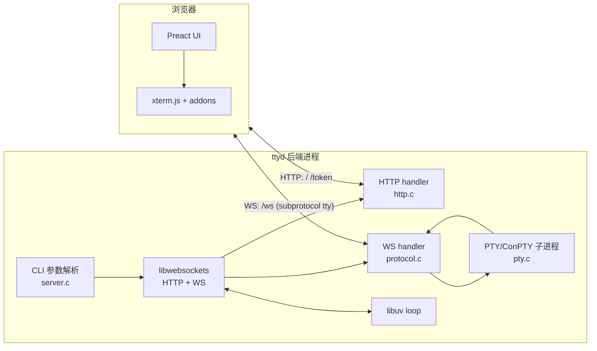
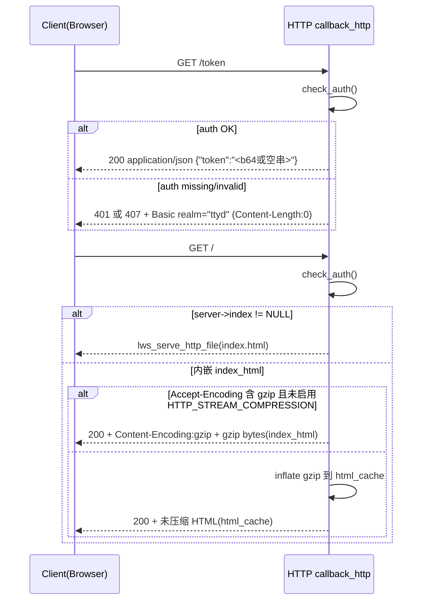
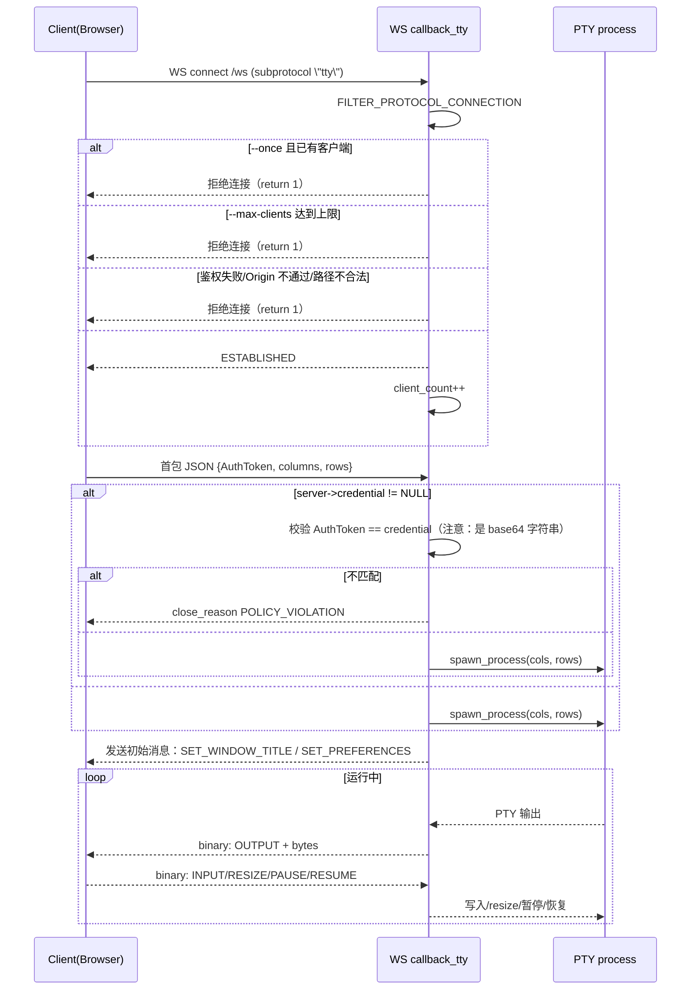
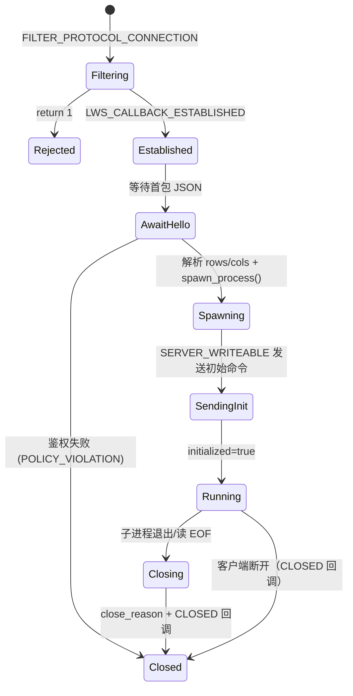

# `ttyd` 架构与执行流（复刻级）

> 本文以“可复刻实现”为目的，既描述**组件结构**，也给出关键链路的**时序图**与**状态机**。  
> 注意：本规格在提取过程中不读取仓库现存 `README* / docs/** / man/** / *.md` 文档；结论完全基于源码与可执行配置。

## 1. 系统边界与角色（System Boundary）

`ttyd` 是一个**单进程**服务器程序，承担以下职责：

- 监听 HTTP 请求，返回内嵌的前端 SPA（或返回用户指定的 `--index` 文件）；
- 提供 `/token` 端点，向浏览器提供 WebSocket 首包 JSON 所需的 token（当启用 `--credential` 时）；
- 接受 WebSocket 连接（端点默认 `/ws`，子协议 `tty`），在收到浏览器首包 JSON 后，为该连接**启动一个子进程**（PTY/ConPTY），并将 PTY/ConPTY I/O 双向转发；
- 维护连接数、once/max-clients、Origin 校验等会话级约束；
- 在连接断开时，按配置（signal/once/exit-no-conn）终止子进程或退出自身。

浏览器端承担：

- 渲染 xterm.js 终端；
- 从 `/token` 获取 token；
- 建立 WebSocket，并发送首包 JSON（`AuthToken/columns/rows`）；
- 后续将键盘输入与窗口 resize 编码为“命令字节 + payload”的二进制帧发送给服务器；
- 接收服务器推送的输出与初始消息（title/preferences），并驱动 UI 行为（重连、overlay、文件传输等）。

## 2. 组件级架构（Component Architecture）

### 2.1 后端组件

- **CLI 配置与启动**：`src/server.c`
  - 解析命令行参数，构造全局 `struct server`（定义于 `src/server.h:64-86`）
  - 配置 libwebsockets `lws_context_creation_info`
  - 初始化 `uv_loop_t` 并与 lws 集成（foreign loop）
- **HTTP 回调协议**：`src/http.c:callback_http`
  - 鉴权（Basic 或反代 header）
  - 返回 `/`（index）、`/token` 与 base-path redirect
  - gzip/解压策略与缓存
- **WebSocket 回调协议**：`src/protocol.c:callback_tty`
  - 连接过滤（once/max/path/origin/auth）
  - 建连后等待首包 JSON，校验 token 并 spawn 子进程
  - 协议：1 字节命令码 + payload 的 binary frame
  - 连接关闭时 kill 子进程、可能退出 ttyd
- **PTY/ConPTY 子进程与 IO**：`src/pty.c`
  - Unix 分支：`forkpty`、`ioctl(TIOCSWINSZ)`、`waitpid`（线程）与 `uv_pipe_t`
  - Windows 分支：ConPTY + named pipe + `CreateProcessW` + `RegisterWaitForSingleObject`
- **工具函数**：`src/utils.c`
  - `xmalloc/xrealloc`、signal 名称转换、`open_uri`、Windows 参数 quote 等

### 2.2 前端组件

- **入口与 URL 组装**：`html/src/components/app.tsx`
  - 计算 `wsUrl` 与 `tokenUrl`
  - 设定默认 `clientOptions/termOptions/flowControl`
- **终端容器**：`html/src/components/terminal/index.tsx`
  - `componentDidMount`：先 `refreshToken()`，再 `open()`，再 `connect()`
  - 包含 `Modal`（选择文件）并调用 xterm addon 发送文件
- **xterm 协议实现**：`html/src/components/terminal/xterm/index.ts`
  - WebSocket 创建（子协议 `tty`）
  - 首包 JSON：`{AuthToken, columns, rows}`
  - 接收服务端命令：OUTPUT/TITLE/PREFERENCES
  - 根据 preferences 启用 Zmodem/Trzsz/Sixel/renderer 等
  - 重连逻辑、beforeunload 提示、复制 overlay、resize overlay
- **Overlay addon**：`html/src/components/terminal/xterm/addons/overlay.ts`
- **Zmodem/Trzsz addon**：`html/src/components/terminal/xterm/addons/zmodem.ts`
- **Modal + SCSS**：`html/src/components/modal/*`
- **全局样式**：`html/src/style/index.scss`

## 3. 架构图（Mermaid）

## 4. 关键执行链路（Critical Paths）

### 4.1 启动链路：`main()` → LWS + UV + 协议回调

关键事实（必须复刻）：

- 默认端口：`7681`（`src/server.c:320`）
- 默认 LWS options：`LWS_SERVER_OPTION_LIBUV | LWS_SERVER_OPTION_VALIDATE_UTF8 | LWS_SERVER_OPTION_DISABLE_IPV6`（`src/server.c:326`）
- 注册协议：
  - `http-only` → `callback_http`（`src/server.c:28-31`）
  - `tty` → `callback_tty`（同上）
- `server->loop`：
  - 在 `server_new()` 中 `uv_loop_init()`（`src/server.c:200-203`）
  - 后续作为 `foreign_loops[0]` 传给 lws（`src/server.c:589-593`）
- 若启用 `--browser`：
  - URL 格式：`http(s)://localhost:<port>`（`src/server.c:609-612`）
  - 使用 `open_uri()` 打开（`src/utils.c:77-91`）

### 4.2 HTTP 请求链路：`GET /` / `GET /token`

### 4.3 WebSocket 链路：过滤 → 建连 → 首包 JSON → spawn → 数据转发

## 5. 状态机（State Machines）

### 5.1 单个 WS 连接的服务器侧状态机

### 5.2 “初始消息发送”子状态（必须复刻的实现细节）

服务端在连接建好且 spawn 完成后，会在 `LWS_CALLBACK_SERVER_WRITEABLE` 中逐条发送初始命令（`src/protocol.c:253-267`）：

- `SET_WINDOW_TITLE`（命令字节 `'1'`）：
  - payload：`"<server->command> (<hostname>)"`（`src/protocol.c:24-27`）
- `SET_PREFERENCES`（命令字节 `'2'`）：
  - payload：服务端构造的 JSON（`server->prefs_json`），见 `src/protocol.c:28-30`

当 `initial_cmd_index == sizeof(initial_cmds)`，服务端将：

- `pss->initialized = true`
- 调用 `pty_resume(pss->process)`（开始读取 PTY 并向客户端输出）

> 注意：当前 PTY 的 pause/resume 标志位实现存在不一致，导致“暂停”可能不生效；复刻实现时应以本规格在 `spec/04_Business_Logic/RULES.md` 记录的“观察到的行为”作为验收标准。

