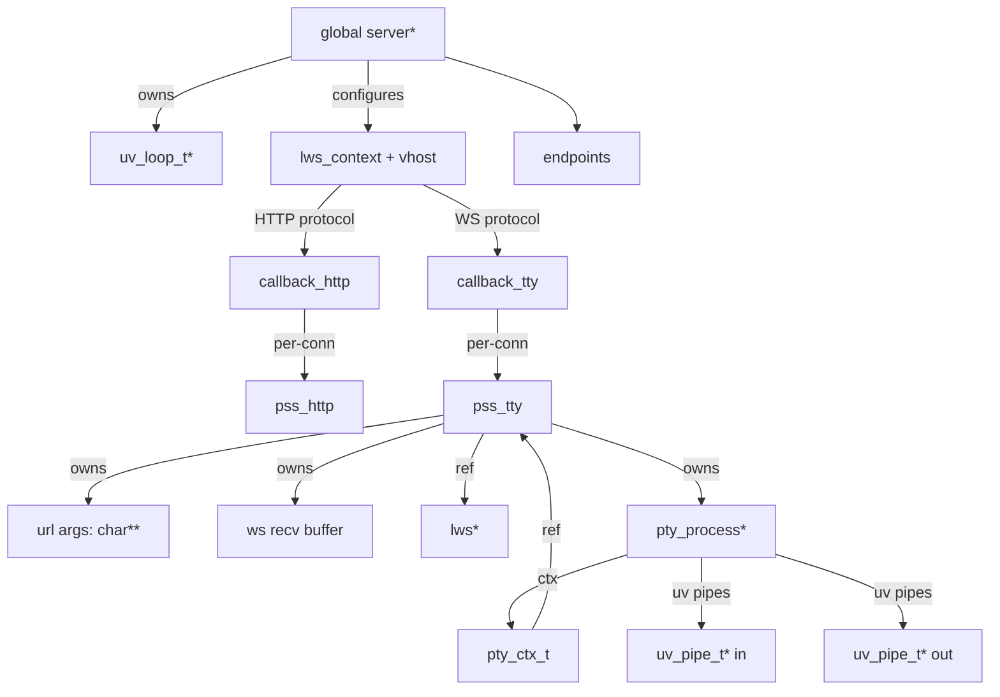

# 数据关系与资源拥有关系（Relationships）

> 本项目无 DB，因此不存在传统 ER 图；这里描述的是**运行期对象之间的引用/所有权/生命周期关系**。

## 1. 关系总览图（Mermaid）

## 2. 所有权与释放责任（Ownership Rules）

### 2.1 `server`（进程级）

- `server` 由 `server_new()` 分配，`server_free()` 释放（见 `src/server.c:163-230`）。
- `server->loop`：
  - `server_new()` 分配并 `uv_loop_init`
  - `server_free()` 调用 `uv_loop_close` 并释放
- `context`（全局 `struct lws_context *context`）：
  - 由 `lws_create_context(&info)` 创建
  - 由 `lws_context_destroy(context)` 释放（见 `src/server.c:594-630`）

### 2.2 `endpoints`（全局）

- 初始值为字符串字面量；
- 若启用 `--base-path`，会为每个端点执行 `strdup()` 并覆盖指针；
- 当前实现未显式释放被覆盖后的 `endpoints.*`（进程退出时由 OS 回收）。复刻时可选择补齐释放，但不能改变对外行为。

### 2.3 `pss_http`（HTTP 连接级）

- `pss_http.buffer` 可能指向三种来源：
  1) `strdup()` 的 token JSON → 必须 `free`
  2) 静态数组 `index_html` → 不得 free
  3) 解压缓存 `html_cache` → 不得 free
- 释放逻辑：`pss_buffer_free()`（`src/http.c:82-84`）。

### 2.4 `pss_tty`（WS 连接级）

- `pss_tty.args[i]`：由 URL query 解析时 `strdup`，在 `LWS_CALLBACK_CLOSED` 逐项 `free`（`src/protocol.c:369-371`）。
- `pss_tty.buffer`：用于拼接 fragmented WS message；在处理完成后 `free`，或在 CLOSED 时 `free`（`src/protocol.c:356-359, 367`）。
- `pss_tty.pty_buf`：由 PTY read_cb 生成并挂到 `pss_tty`；写出后 `pty_buf_free`（`src/protocol.c:275-279`），CLOSED 时也会释放（`src/protocol.c:368`）。
- `pss_tty.process`：
  - spawn 成功后由 `pss` 持有指针
  - 进程退出回调中会将 `pss->process = NULL`（`src/protocol.c:102-105`）
  - WS CLOSED 时若进程仍在运行则 kill（`src/protocol.c:373-379`）

### 2.5 `pty_process.ctx`（`pty_ctx_t`）

- `pty_ctx_t` 由 `pty_ctx_init(pss)` 分配，作为 `process->ctx` 存放；
- 进程退出回调 `process_exit_cb` 负责释放 ctx（`src/protocol.c:95-109`）；
- 当 WS 已关闭时，会将 `((pty_ctx_t*)process->ctx)->ws_closed=true`，从而使后续读回调丢弃数据并尽快释放缓冲（`src/protocol.c:83-86, 373-375`）。

## 3. 关键一致性约束（Invariants）

- 对于每条 WS 连接：最多 spawn 一个 `pty_process`（`JSON_DATA` 分支中 `if (pss->process != NULL) break;`）。
- `server->client_count` 必须与已建立但未关闭的 WS 连接数一致；其增减仅发生在：
  - `LWS_CALLBACK_ESTABLISHED`：`++`
  - `LWS_CALLBACK_CLOSED`：`--`
- 当启用 `--once` 或 `--exit-no-conn`：当 `client_count==0` 时进程必须 `exit(0)`（`src/protocol.c:382-387`）。

