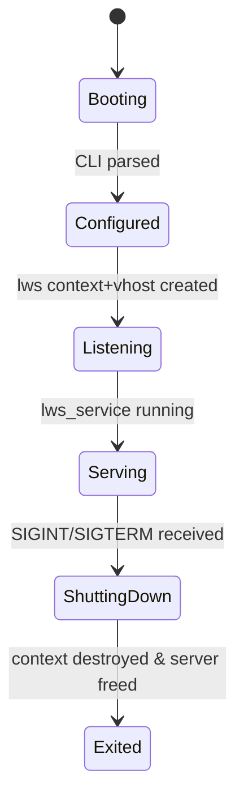
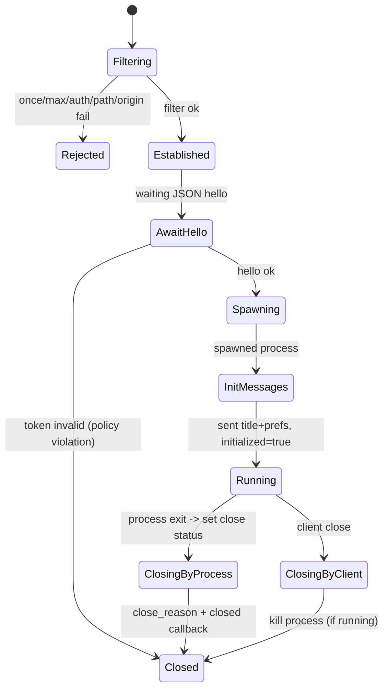
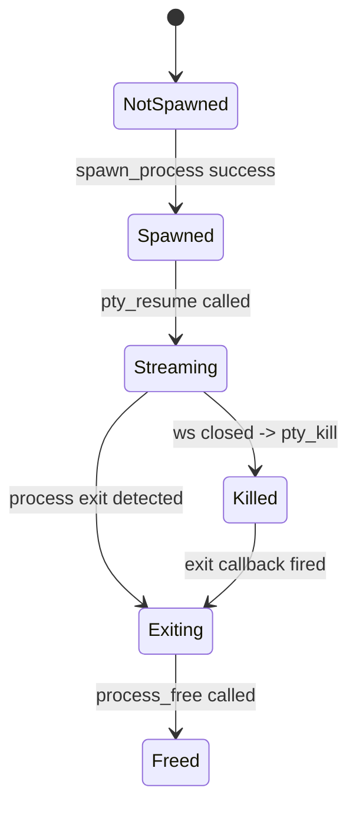
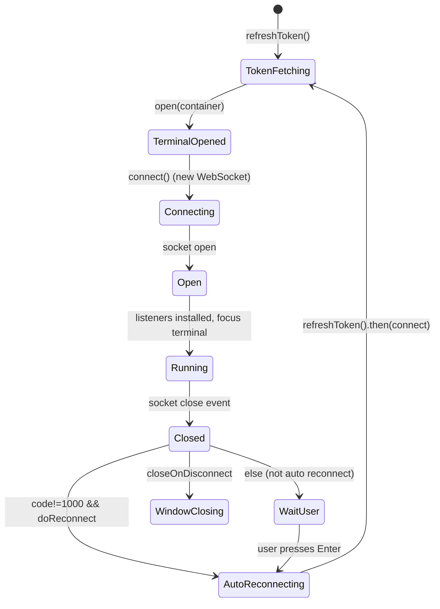

# 状态机（State Machines）

> 本文用状态机形式定义 `ttyd` 的核心生命周期与会话生命周期。  
> 状态机是“复刻验收”时最重要的行为约束之一：任何遗漏/多余的转移都会导致行为不一致。

---

## 1. `ttyd` 进程生命周期状态机

### 关键转移说明

| From | To | 触发 | 条件 | 副作用 |
|---|---|---|---|---|
| Booting | Configured | `server_new` + CLI 解析 | - | 构造 `server`、`prefs_json`、`info` |
| Configured | Listening | `lws_create_context` + `lws_create_vhost` 成功 | - | 开始监听端口/或 UNIX socket |
| Listening | Serving | 进入 `lws_service(context,0)` | - | 进入事件循环 |
| Serving | ShuttingDown | SIGINT/SIGTERM | `force_exit=false` | `force_exit=true`，`lws_cancel_service`，`uv_stop` |
| ShuttingDown | Exited | `lws_service` 返回 | - | destroy context，释放 server |

---

## 2. 单条 WS 连接的服务器侧状态机

### 关键守卫条件（Guards）

- `Filtering -> Rejected` 的原因见 `spec/03_API/ERRORS.md` “WS：拒绝连接”章节。
- `AwaitHello -> Closed`：
  - 仅当启用 `--credential` 且 `AuthToken != server->credential`。
- `Established -> AwaitHello`：
  - 注意：即使 WS filter 已经通过 Authorization 校验，在启用 credential 的情况下仍需要 hello token 校验（两段式鉴权）。

---

## 3. PTY 子进程状态机（抽象）

> PTY 状态与 libuv 读写耦合紧密，本节只表达“可观测行为”的状态机。

### 重要实现细节（必须复刻）

- spawn 成功后：`process->paused = true`（Unix/Windows 都如此设置）  
- `pty_resume()` 在现有实现中不会把 `paused` 变更为 false，导致 `pty_pause()` 的 guard 条件与实际“是否在读”可能不一致（详见 `spec/04_Business_Logic/RULES.md` 规则 12.3）。

---

## 4. 前端连接状态机（用于复刻 UI 行为）

> 本状态机以 `html/src/components/terminal/xterm/index.ts` 为事实源。

### 关键副作用（微文案必须一致）

- `socket open`：
  - 发送 hello JSON：`{AuthToken, columns, rows}`
  - 若 `opened==true`：执行 `terminal.reset()` 并 overlay 显示 `Reconnected`
- `socket close`：
  - overlay 显示 `Connection Closed`
  - 若自动重连：overlay `Reconnecting...`，然后 `refreshToken().then(connect)`
  - 否则：overlay `Press ⏎ to Reconnect`，并监听 Enter 键触发重连
  - 若 `closeOnDisconnect==true`：`window.close()`

