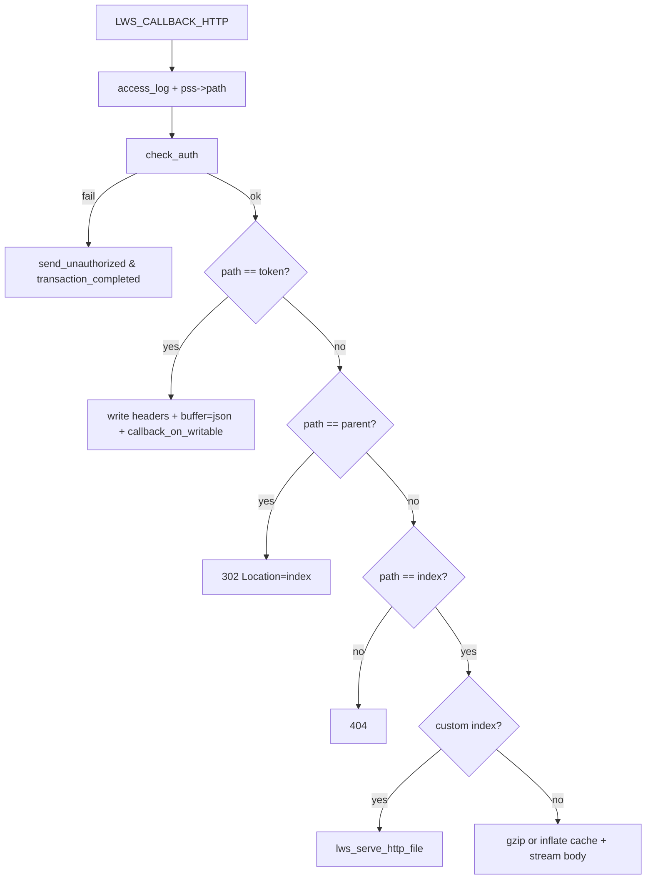
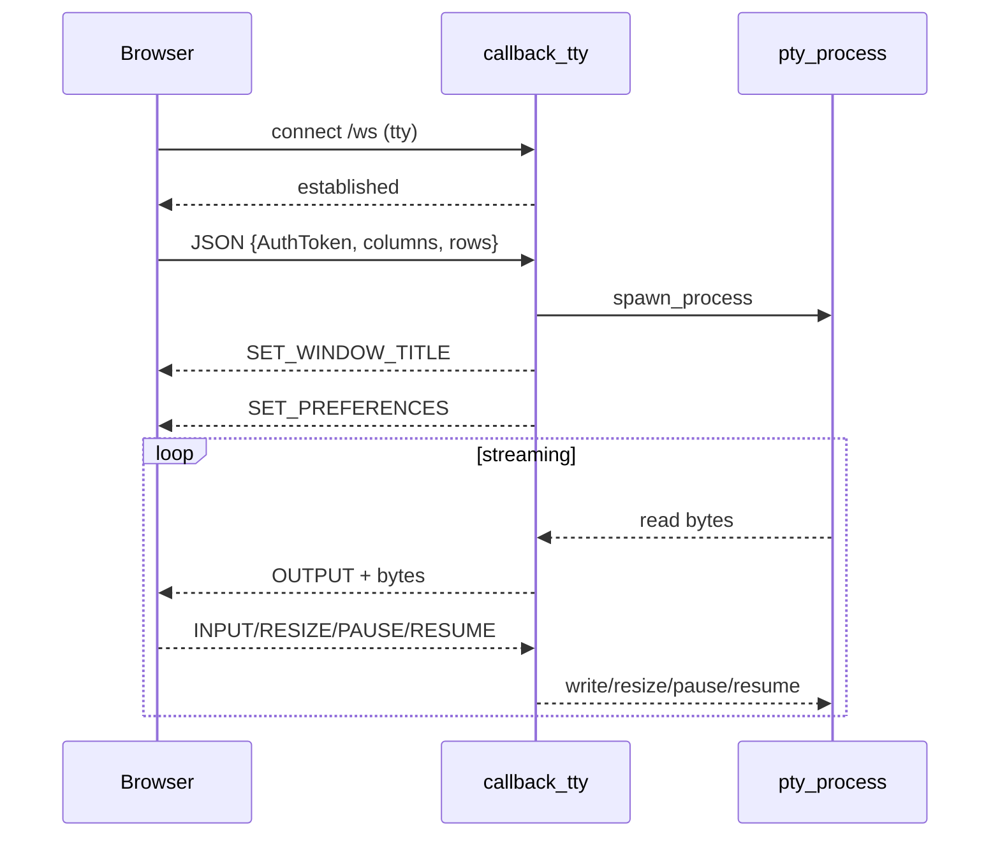

# 核心流程（Workflows）

> 本文把 `ttyd` 的关键执行链路拆成可复刻的步骤清单，并提供流程图/时序图。  
> 事实源：`src/server.c`、`src/http.c`、`src/protocol.c`、`src/pty.c`、以及前端 `html/src/**`。

---

## Workflow 1：进程启动与服务就绪

### 目的
完成配置解析、初始化 libuv + libwebsockets，并开始对外提供 HTTP/WS 服务。

### 触发
执行 `ttyd ... <command> ...`。

### 步骤

1) **解析命令起始位置**
   - 输入：`argc, argv`
   - 行为：`calc_command_start()` 用 `getopt_long` 在拷贝 argv 上跑一遍，找到 `<command>` 对应的原 argv 下标（`src/server.c:266-301`）
   - 输出：`start`（命令开始下标）

2) **构造全局 server**
   - 行为：`server_new(argc, argv, start)`（`src/server.c:163-204`）
   - 输出：全局 `server`（含 `argv/command/loop`）

3) **构造 lws info 默认值**
   - 行为：填充 `lws_context_creation_info info`（`src/server.c:318-331`）
   - 关键默认：
     - `port=7681`
     - `options` 包含 `LIBUV`、`VALIDATE_UTF8`、`DISABLE_IPV6`
     - `protocols = protocols[]`

4) **解析 CLI options 并更新配置**
   - 行为：`while ((c = getopt_long(start, argv, ...)) != -1) switch(c)`（`src/server.c:347-525`）
   - 输出：
     - `server` 字段（writable/check_origin/once/max_clients/exit_no_conn/credential/auth_header/index/cwd/terminal_type/prefs_json 等）
     - `info` 字段（port/iface/uid/gid/pt_serv_buf_size/ssl_* 等）
     - `retry` policy（LWS>=4）

5) **校验必需命令**
   - 行为：若 `server->command` 为空则报错并返回 `-1`（`src/server.c:529-532`）

6) **配置 lws 日志与 server header**
   - 行为：
     - `lws_set_log_level(debug_level, NULL)`（`src/server.c:534`）
     - `info.server_string = "ttyd/<ver> (libwebsockets/<ver>)"`（`src/server.c:536-539`）

7) **归一化 auth_header**
   - 行为：`lowercase` + 末尾 `:`（`src/server.c:581-587`）

8) **把 uv loop 注入 lws（foreign loop）并创建 context/vhost**
   - 行为：
     - `info.foreign_loops = [server->loop]`
     - `info.options |= EXPLICIT_VHOSTS`
     - `context = lws_create_context(&info)`
     - `vhost = lws_create_vhost(context, &info)`
   - 错误：创建失败返回 `1`（`src/server.c:594-604`）

9) **获取监听端口并可选打开浏览器**
   - 行为：
     - `port = lws_get_vhost_listen_port(vhost)`（`src/server.c:605-606`）
     - 若 `--browser`：拼 URL 并 `open_uri(url)`（`src/server.c:608-612`）

10) **注册 SIGINT/SIGTERM 并进入服务**
   - 行为：
     - `uv_signal_init/start`（`src/server.c:614-620`）
     - `lws_service(context, 0)`（`src/server.c:622`）
   - 退出：信号回调设置 `force_exit` 并 `lws_cancel_service`、`uv_stop`（`src/server.c:232-253`）

11) **销毁 context 并释放 server**
   - 行为：`lws_context_destroy(context)` + `server_free(server)`（`src/server.c:629-633`）

### 流程图
```mermaid
flowchart TD
  A[main()] --> B[calc_command_start]
  B --> C[server_new]
  C --> D[parse CLI options]
  D --> E{command present?}
  E -- no --> X[print error & return -1]
  E -- yes --> F[normalize auth_header]
  F --> G[create lws context + vhost (with uv foreign loop)]
  G --> H[register signals]
  H --> I[lws_service]
  I --> J[destroy context]
  J --> K[server_free]
```

---

## Workflow 2：HTTP 请求处理（/token、/、redirect、404）

详见 `spec/03_API/ENDPOINTS.md`，此处只给出“分支骨架”：



---

## Workflow 3：WS 建连→首包→spawn→初始消息→终端流

### 目的
为每个 WS 连接启动一个 PTY 子进程，并建立双向数据转发。

### 步骤（服务器侧）

1) **Filter 阶段拒绝非法连接**
   - 触发：`LWS_CALLBACK_FILTER_PROTOCOL_CONNECTION`
   - 条件：once/max/auth/path/origin（见 `spec/03_API/ENDPOINTS.md`）

2) **建立连接并解析 URL args**
   - 触发：`LWS_CALLBACK_ESTABLISHED`
   - 行为：若 `--url-arg` 启用，解析 query `arg=`（规则见 `spec/04_Business_Logic/RULES.md`）

3) **等待首包 JSON 并 spawn**
   - 触发：`LWS_CALLBACK_RECEIVE`，且首字节为 `{`
   - 行为：
     - 解析 `columns/rows`
     - （可选）校验 `AuthToken`
     - `spawn_process(pss, columns, rows)`

4) **发送初始消息**
   - 触发：`LWS_CALLBACK_SERVER_WRITEABLE`，且 `initialized==false`
   - 行为：依次发送 `SET_WINDOW_TITLE` 与 `SET_PREFERENCES`，最后 `initialized=true` 并 `pty_resume(process)`

5) **转发输出（PTY→WS→浏览器）**
   - 触发：PTY read_cb 把 `pty_buf` 挂到 `pss` 并请求 `lws_callback_on_writable`
   - 在 `SERVER_WRITEABLE`：
     - 将 `pty_buf` 发送为 `OUTPUT` 帧
     - `pty_resume(process)` 继续读下一段

6) **处理输入与控制（浏览器→WS→PTY）**
   - 触发：`LWS_CALLBACK_RECEIVE`
   - 分支：
     - `INPUT`：可写模式才写入
     - `RESIZE_TERMINAL`：更新 cols/rows 并 `pty_resize`
     - `PAUSE/RESUME`：调用 `pty_pause/pty_resume`

### 时序图（服务器侧）
（更完整版本见 `spec/00_Overview/ARCHITECTURE.md`）



---

## Workflow 4：关闭与清理

### 触发 A：子进程退出
事实源：`src/protocol.c:95-106`。

- `exit_cb` 会设置 `pss->lws_close_status`：
  - `exit_code==0` → 1000
  - else → 1006
- 并请求 `lws_callback_on_writable`，由 WS writeable 回调发起关闭。

### 触发 B：客户端断开
事实源：`src/protocol.c:362-388`。

- CLOSED 回调中：
  - 释放内存
  - kill 子进程（若仍运行）
  - 若 `--once` 或 `--exit-no-conn` 且 `client_count==0`：直接 `exit(0)`

### 触发 C：SIGINT/SIGTERM
事实源：`src/server.c:232-253`。

- 第一次信号：设置 `force_exit=true` 并请求 lws 取消 service、停止 uv loop；
- 若再次触发且 `force_exit` 已为 true：`exit(EXIT_FAILURE)`。

