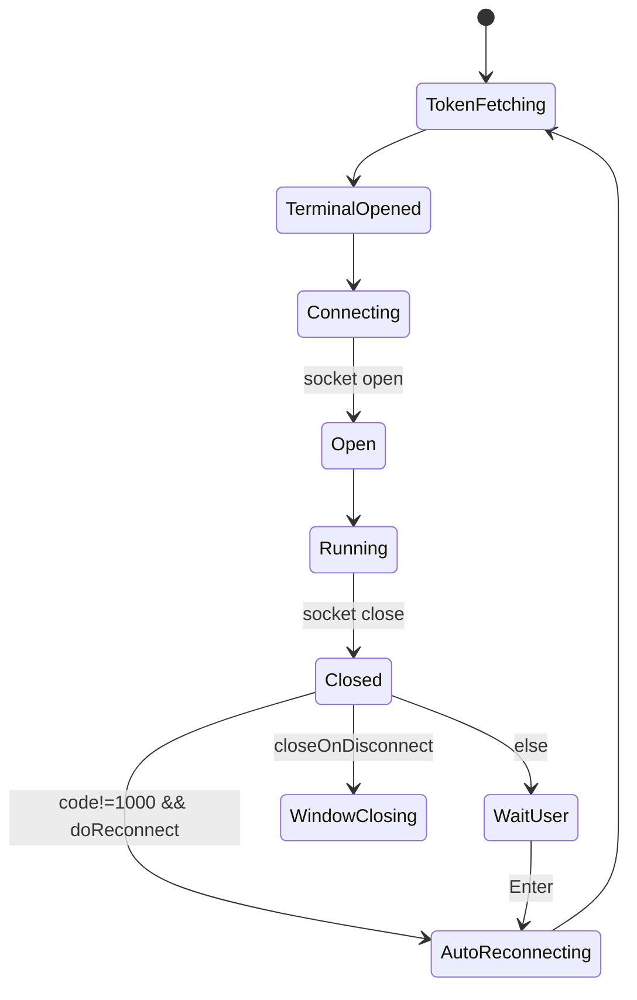

# 模式与交互规则（Patterns，像素级）

> 本文描述跨组件的行为模式：WS 连接生命周期、preferences 合并、流控、overlay 文案与触发条件等。  
> 事实源：`html/src/components/app.tsx`、`html/src/components/terminal/xterm/index.ts`、`html/src/components/terminal/xterm/addons/overlay.ts`。

---

## Pattern 1：URL 组装（wsUrl / tokenUrl）

事实源：`html/src/components/app.tsx:8-11`。

### 规则

- `wsUrl`：
  - 协议：若当前页面是 https，则 `wss:`；否则 `ws:`
  - path：取 `window.location.pathname` 并移除末尾所有 `/`（正则 `[/]+$`）
  - 拼接：`${wsProto}//${host}${path}/ws${search}`
- `tokenUrl`：
  - 拼接：`${pageProto}//${host}${path}/token`

### 例子

1) 页面：`http://example.com/`
   - `path = ""`
   - `wsUrl = "ws://example.com/ws"`
   - `tokenUrl = "http://example.com/token"`

2) 页面：`https://example.com/mounted/here/?foo=1`
   - `path="/mounted/here"`（末尾 `/` 被移除）
   - `wsUrl="wss://example.com/mounted/here/ws?foo=1"`
   - `tokenUrl="https://example.com/mounted/here/token"`

---

## Pattern 2：WebSocket 连接与重连（核心状态机）

事实源：`html/src/components/terminal/xterm/index.ts:248-306`。

### 2.1 建连流程（首次）

1) `refreshToken()`（HTTP GET tokenUrl）
2) `open(container)`：创建 xterm Terminal，加载 addon，挂载 DOM，并 `fit()`
3) `connect()`：创建 `new WebSocket(wsUrl, ['tty'])`
4) socket `open`：
   - 控制台日志：`[ttyd] websocket connection opened`
   - 发送 hello JSON（示例）：
     ```json
     {"AuthToken":"dXNlcjpwYXNz","columns":80,"rows":24}
     ```
   - 首次连接 `opened=false`：
     - 置 `opened=true`
   - `doReconnect = reconnect`（默认 true）
   - `initListeners()`（注册 title/data/binary/resize/selection/resize event/beforeunload）
   - `terminal.focus()`

### 2.2 断开与重连流程

socket `close` 时：

1) 控制台日志：`[ttyd] websocket connection closed with code: ${event.code}`
2) overlay 显示：`Connection Closed`
3) `dispose()`（移除注册的 listeners）
4) 分支：
   - 若 `event.code !== 1000 && doReconnect`：
     - overlay：`Reconnecting...`
     - `refreshToken().then(connect)`
   - else if `closeOnDisconnect==true`：
     - `window.close()`
   - else（需要用户确认重连）：
     - 注册一次 `terminal.onKey`：
       - 若按键 `Enter`：
         - dispose key listener
         - overlay：`Reconnecting...`
         - `refreshToken().then(connect)`
     - overlay：`Press ⏎ to Reconnect`

### 2.3 “重连成功”的特殊行为（opened==true）

当 socket `open` 且 `opened==true`：
- `terminal.reset()`
- `terminal.options.disableStdin = false`
- overlay 显示：`Reconnected`，并在 300ms 后消失

### 2.4 状态机（Mermaid）



---

## Pattern 3：Overlay 文案与触发条件（逐字）

> 以下字符串必须逐字一致（大小写/标点/空格/特殊符号都一致）。

| 触发点 | 文案 | timeout |
|---|---|---:|
| socket open 且 opened==true | `Reconnected` | 300 |
| socket close（任何 code） | `Connection Closed` | 未传 timeout（保持显示直到被覆盖） |
| 自动重连开始 | `Reconnecting...` | 未传 |
| 用户确认重连提示 | `Press ⏎ to Reconnect` | 未传 |
| resize（若 resizeOverlay==true） | `${cols}x${rows}` | 300 |
| selection copy 成功 | `✂` | 200 |

---

## Pattern 4：beforeunload 离开提示（逐字）

事实源：`html/src/components/terminal/xterm/index.ts:143-152`。

触发条件：
- 事件：`beforeunload`
- guard：`socket.readyState === WebSocket.OPEN`

返回文案（必须逐字一致）：
`Close terminal? this will also terminate the command.`

disableLeaveAlert：
- 当 preferences 中 `disableLeaveAlert=true`：
  - 会 `window.removeEventListener('beforeunload', this.onWindowUnload)`
  - 控制台日志：`[ttyd] Leave site alert disabled`

---

## Pattern 5：终端输入编码（命令字节 + payload）

事实源：`html/src/components/terminal/xterm/index.ts:229-245`。

- 文本输入（string）：
  - payload[0] = `'0'`（INPUT）
  - 使用 `TextEncoder.encodeInto(data, payload.subarray(1))`
  - 发送实际写入长度 `stats.written + 1`
- 二进制输入（Uint8Array）：
  - payload[0] = `'0'`
  - payload.set(data, 1)

> 这是与后端 WS 协议的硬契约（见 `spec/03_API/ENDPOINTS.md`）。

---

## Pattern 6：resize 编码与 overlay

事实源：`html/src/components/terminal/xterm/index.ts:184-190`。

- xterm `onResize({cols, rows})`：
  - 发送：`Command.RESIZE_TERMINAL + JSON.stringify({columns: cols, rows: rows})`
  - 若 `resizeOverlay==true`：overlay 显示 `${cols}x${rows}`（300ms）

`disableResizeOverlay=true` 会把 `resizeOverlay=false` 并打印日志：`[ttyd] Resize overlay disabled`。

---

## Pattern 7：preferences 合并顺序与类型解析

事实源：`html/src/components/terminal/xterm/index.ts:357-362, 309-339`。

合并顺序（后者覆盖前者）：
1) `this.options.clientOptions`（默认值来自 App）
2) 服务端下发 prefs（JSON.parse）
3) URL query prefs（`parseOptsFromUrlQuery(window.location.search)`）

URL query 的类型推断规则：
- 若该 key 在 `clientOptions` 或 `terminal.options` 中存在同名默认值，则按其 `typeof` 决定：
  - boolean：`true/1` → true
  - number/bigint：`parseInt`
  - string：原样
  - object：`JSON.parse(queryVal)`
- 若 unknown：打印 warning，并按 string 处理

---

## Pattern 8：rendererType 切换与降级

事实源：`html/src/components/terminal/xterm/index.ts:471-534`。

- `'webgl'`：
  - 创建 `new WebglAddon()`
  - 注册 `onContextLoss`：context loss 时 dispose
  - 若加载失败：fallback 到 canvas
- `'canvas'`：
  - 创建 `new CanvasAddon()`
  - 若加载失败：fallback 到 dom renderer
- `'dom'`：
  - dispose webgl/canvas addon

日志文案（作为可观察行为）：
- `[ttyd] WebGL renderer loaded`
- `[ttyd] WebGL renderer could not be loaded, falling back to canvas renderer`
- `[ttyd] canvas renderer loaded`
- `[ttyd] canvas renderer could not be loaded, falling back to dom renderer`
- `[ttyd] dom renderer loaded`

---

## Pattern 9：输出流控（written/pending + PAUSE/RESUME）

事实源：`html/src/components/terminal/xterm/index.ts:206-227`。

默认参数（来自 App）：
- `limit=100000`
- `highWater=10`
- `lowWater=4`

规则：
- `written += data.length`
- 若 `written > limit`：
  - `terminal.write(data, callback)`，callback 中 `pending--`；若 `pending < lowWater` 则发送 `RESUME`
  - `pending++`
  - `written = 0`
  - 若 `pending > highWater` 则发送 `PAUSE`
- 否则：`terminal.write(data)`（无 pending 统计）

> 后端对 PAUSE/RESUME 的实际效果存在已知细节（见 `spec/04_Business_Logic/RULES.md` 规则 12.3）。
